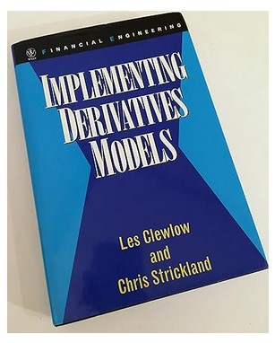
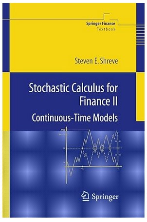

# Numerical Implementation of Derivative Pricing #

This project explores the basics of numerical implementaion of derivative pricing algorithms in Python.

## Project Description ##

The objective of this project is to introduce and implement a range of models and methods used to price derivative securities. All the descriptions are generally based on the classical Black-Scholes world. 

The Python implementations are intended to be concise and efficient while as well being accessible.

Basic understanding of stochastic calculus and probability theory is assumed.

The below two references are sufficient to work through the implementation and theory provided here.




## For Contributions ##

1. Fork the project
2. Create your feature branch (```git checkout -b feature/AmazingFeature```)
3. Commit your changes (```git commit -am 'Add some AmazingFeature'```)
4. Push to the branch (```git push origin feature/AmazingFeature```)
5. Open a pull request
